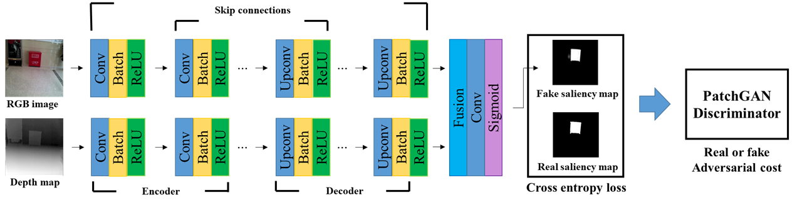

# RGB-D Salient Object Detection Using Conditional GAN
This code is a Pytorch implementation of [RGB-D salient object detection using cGAN](http://dcollection.sogang.ac.kr:8089/dcollection/public_resource/pdf/000000063091_20191107151546.pdf).
Two-stream network generates the pixel-wise saliency map and PatchGAN discriminator learns to determine whether the generated saliency map is real or fake.
<center></center>

## Requirements
* Python 3
* Pytorch 1.4
* Torchvision 0.5.0
* Pillow

##  Experimental enviroment
* Ubuntu 18.04
* Nvidia Geforce GTX 1080Ti
* [Pytorch 1.4 docker image](https://hub.docker.com/r/pytorch/pytorch/)

## Getting started
1. Clone this repository
   ```
    git clone https://github.com/wj1224/rgb-d_salient_object_detection.git
   ```
   
2. Prepare datasets
    We use [NLPR](https://sites.google.com/site/rgbdsaliency/dataset) and [NJUDS2000](https://svalianju.wixsite.com/home/salient-object-detection) RGB-D saliency detection datasets to train the networks. (additionally [DUT-OMRON](http://saliencydetection.net/dut-omron/), [HKU-IS](https://sites.google.com/site/ligb86/hkuis), and [MSRA10K](https://mmcheng.net/msra10k/) RGB saliency datasets are used with synthetic depth maps that was generated using [pix2pix](https://arxiv.org/abs/1611.07004).
    
3. Training
    ```
    cd rgb-d_salient_object_detection
    python main.py \
        --mode train \
        --input_dir path/to/trainset \
        --output_dir path/to/logs \
        --max_epochs 100 \
        --cuda \
        --[args]
   ```
   See below for more args. 
    
4. Testing
    ```
    python main.py \
        --mode test \
        --input_dir path/to/testset \
        --output_dir path/to/output_saliency_maps \
        --checkpoint path/to/saved_logs \
        --n_epochs 100 \
        --cuda
    ```
    
5. More details of args.
    There are several options on running <text>main.py</text> with --[args].
    ```
    --mode ["train", "test] : train or test mode selection
    --input_dir [path/to/imgs] : Folder path which containing input images
    --output_dir [path/to/output] : Folder path to save logs in training or output images in testing
    --checkpoint  [path/to/logs] : Folder path to resume training or use for testing
    --n_epochs [100] : Load checkpoint from trained models with "n_epochs"
    --max_epochs [100] : Number of epochs in training step
    --batch_size [16] : Size of mini-batch
    --cuda : Using GPU
    --threds : Number of threds for data loading
    --ngf [64] : Number of filters on first convolution layer of the generator
    --ndf [16] : Number of filters on first convolution layer of the discriminator
    --lr [0.0002] : Learning rate of Adam optimizer
    --beta1 [0.9] : Momentum of Adam optimizer
    --lambda_g [10.0] : Weight on CrossEntropyLoss term of generator loss function
    --lambda_gp[1.0] : Weight on gradient penalty term of discriminator loss function
    ```
    
6. Pretrained model
    If you want to testing with pretrained model, download [this](https://drive.google.com/open?id=1jJSekQN8LIkp7TGpZtPWvO02aV0bMFgn) and put it path/to/logs. The model was trained by using datasets as described in step 2. You can simply test the model with the following command.
    ```
    python main.py \
        --mode test \
        --input_dir path/to/testset \
        --output_dir path/to/output_saliency_maps \
        --checkpoint path/to/pretrained_model \
        --pretrained \
        --cuda
    ```
    
## Architecture
<center></center>

## Results
* NLPR testset
<center></center>

* NJUDS2000 testset
<center></center>

* F-measure scores
Compared to not using depth maps completely and not using only synthetic depth maps in training step.

    | Dataset | Only RGB | RGB + real depth map | RGB + real and synthetic depth map | 
    | :----------: | :---------: | :----------: | :----------: |
     | NLPR | 0.7705 | 0.7780 | **0.8103** |
     | NJUDS2000 | 0.8014 | 0.8405 | **0.8567** |  
 
## More details
Please see [this](http://dcollection.sogang.ac.kr:8089/dcollection/public_resource/pdf/000000063091_20191107151546.pdf).
